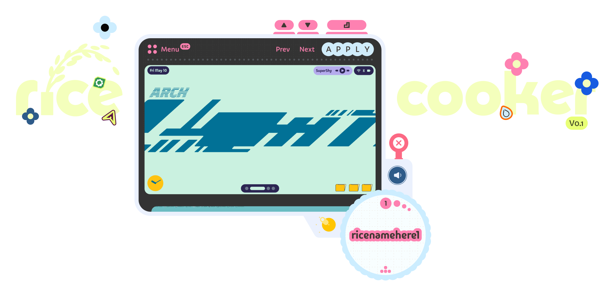
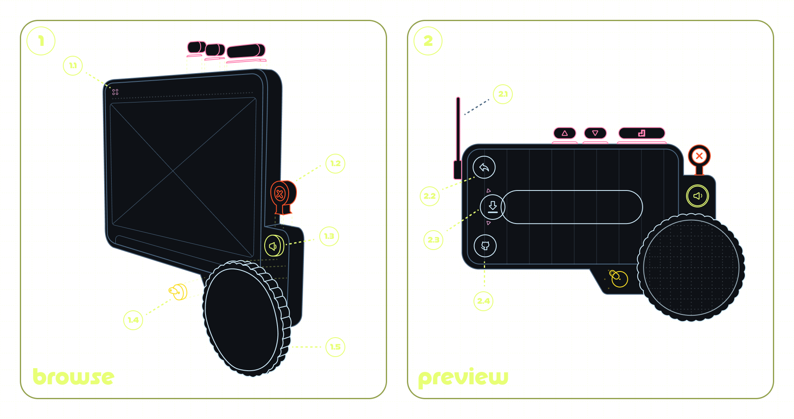

a visual (toy) tool for ricing hyprland.

browse rices, try them live on your desktop, and install them with a keyboard click. if you don't like what you see, _revert_ returns you to the original rice you started with.

rice cooker writes to your hyprland and quickshell config directories. it does not touch your home folder, your dotfiles repo, or anything outside the supported config paths.

## notice

rice cooker is currently only built for arch linux, hyprland on wayland, and quickshell.

you can force it to run on other setups, but rices are not guaranteed to apply cleanly and may break your existing config. rice at your own risk.

## install

```
yay -S rice-cooker
# or paru
```

## features
rice cooker is best experienced with the keyboard and sound on.


**keys**

↑ &nbsp;&nbsp; move selection up
↓ &nbsp;&nbsp; move selection down
↵ &nbsp;&nbsp; apply selection

rice cooker has two modes: (1) browse and (2) preview.

### 1. browse mode (expanded)

explore rices from the community.

- **1.1 sound** — toggle sound on and off
- **1.2 close** — exit rice cooker
- **1.3 theme** — switch between 3 themes
- **1.4 menu**
  - revert (hold ↵ to confirm)
  - submit a rice
  - credits
- **1.5 HUD** — provides context like rice name, rice number, keyboard press indicators

### 2. preview mode (mini)

selecting a rice shows a live preview on your actual desktop. during this mode rice cooker collapses to give the rice room to breathe.

- **2.1 antenna** — extends when content is downloading
- **2.2 leave** — exit preview and revert to your original rice
- **2.3 install** — install the selected rice
- **2.4 dot** — opens the rice's dotfiles on github

preview and install times depend on the size of the rice. you may be prompted for a password when installing dependencies.

## submitting a rice

the rice cooker catalog is built from dotfiles openly shared by the community. share a rice of your own with us (and everyone) through the link below.

a good rice is organized and complete. every submission is reviewed before it lands in the catalog.

[submit a rice →](https://butterfly.so/rice-cooker/submit)

## credits

made for fun by two brothers at butterfly.

[website](https://butterfly.so) &nbsp;|&nbsp; [x](https://twitter.com/butterfly) &nbsp;|&nbsp; [instagram](https://instagram.com/butterfly)
